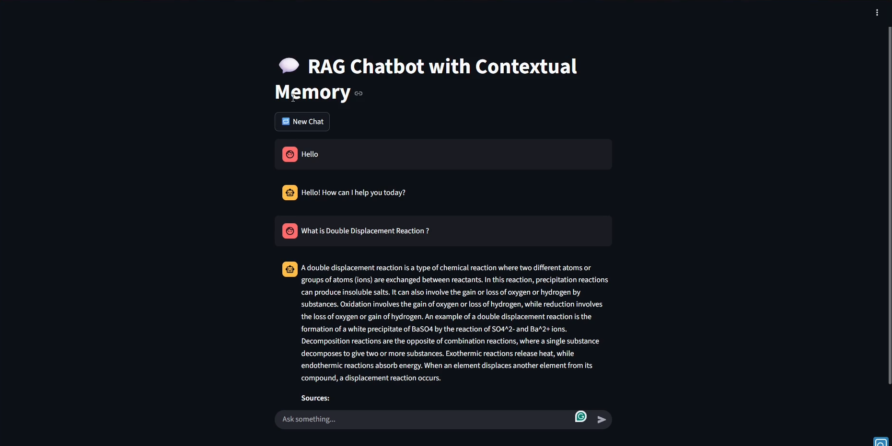
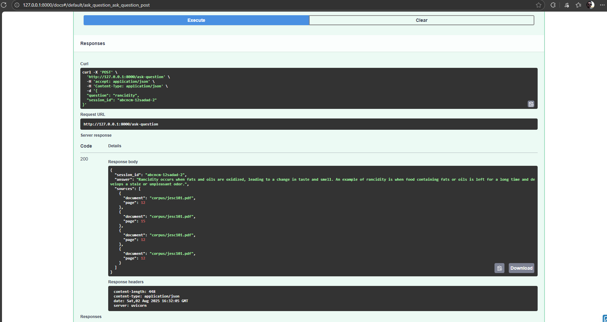

# 🧠 RAG Chatbot

A full-stack Retrieval-Augmented Generation (RAG) chatbot using LangChain, OpenAI, FAISS, FastAPI, and Streamlit. It answers questions based on custom documents with contextual memory, source tracking, and a modern chat UI.

# 🧠 RAG Chatbot with LangChain, Contextual Memory, User Session, FastAPI, and Streamlit

This is a full-stack Retrieval-Augmented Generation (RAG) chatbot using:
- 🧠 LangChain + OpenAI
- 🗃️ FAISS vectorstore
- ⚙️ FastAPI backend
- 💬 Streamlit frontend

## 📁 Project Structure
```
RAG_Langchain_OpenAI_FAISS
├─ corpus
│  └─ jesc101.pdf
├─ main.py
├─ rag_chain.py
├─ rag_langchain_faiss.ipynb
├─ requirements.txt
└─ streamlit_app.py

```

## 📡 Tech stack learned and implemented
- Langchain
- Pypdf
- FAISS
- Open AI Embeddings
- Prompt Engineering
- Model = 'gpt-3.5-turbo'
- Contextual Memory/Conversation Buffer memory using `RunnableWithMessageHistory`
- RAG Pipeline CBM, User session state with UUID
- Streamlit
- Fastapi
- Uvicorn

## 📡 FAST API Endpoints

| Endpoint              | Purpose                   |
| --------------------- | ---------------------     |
| `/post//ask-question`      | Question to the model     |

## 🔧 Project Architecture Overview

| **Component**         | **Implementation**                                  |
|-----------------------|-----------------------------------------------------|
| **Vector Store**      | FAISS (`langchain_community.vectorstores.FAISS`)     |
| **Embedding Model**   | OpenAI Embeddings (`text-embedding-ada-002`) via `OpenAIEmbeddings` |
| **LLM**               | OpenAI Chat Model (`gpt-3.5-turbo`) via `ChatOpenAI` |
| **Retriever**         | FAISS retriever `.as_retriever()` with `.invoke(query)` |
| **Memory Type**       | Conversation Buffer via `InMemoryChatMessageHistory` |
| **Session Tracking**  | UUID-based `session_id` passed through FastAPI & Streamlit |
| **Frontend**          | Streamlit (`st.chat_input`, `st.chat_message`)      |
| **Backend**           | FastAPI endpoint `/ask-question` (POST)             |
| **Prompt Template**   | Custom `PromptTemplate` with context + question     |
| **LangChain Chain**   | `RunnableMap` composed pipeline + `RunnableWithMessageHistory` |
| **Secrets Handling**  | `.env` file loaded with `dotenv` (ignored via `.gitignore`) |
| **Chat History Store**| In-memory Python `dict` keyed by `session_id`       |
| **Document Source**   | PDF documents (e.g., `corpus/jesc101.pdf`) indexed into FAISS |


## 📡 Key Observations

## 📘 Key Learnings from This RAG Chatbot Project

| **Category**             | **Learning** |
|--------------------------|--------------|
| **Retrieval-Augmented Generation (RAG)** | Learned how to combine a vector database with an LLM to build context-aware Q&A systems. |
| **LangChain Framework** | Understood how to use `RunnableMap`, `PromptTemplate`, and `RunnableWithMessageHistory` to modularize pipelines. |
| **Vector Search (FAISS)** | Gained hands-on experience building and querying a FAISS index using OpenAI embeddings. |
| **OpenAI API** | Integrated `gpt-3.5-turbo` and `text-embedding-ada-002` for inference and vector representation. |
| **Contextual Memory** | Implemented session-specific memory using `InMemoryChatMessageHistory`, enabling follow-up conversations. |
| **Session Management** | Managed user context across requests using `session_id` to isolate memory for different users or chats. |
| **FastAPI** | Created a scalable backend API endpoint for processing user queries. |
| **Streamlit** | Built a modern, chat-style UI using `st.chat_input()` and `st.chat_message()`. |
| **Environment Management** | Used `.env` and `.gitignore` to safely manage API keys and project files. |
| **Error Handling & Debugging** | Interpreted LangChain warnings, OpenAI errors, and stack traces to improve robustness. |
| **Prompt Engineering** | Refined prompt templates to control model behavior and improve accuracy and fallback handling. |
| **Project Structuring** | Organized the project into reusable components (frontend, backend, chain, utils) for maintainability. |


## 📡 How to Run the app
### 1. Set your API Key
`OPENAI_API_KEY=sk-xxxxxxxxxxxxxxxxxxxxxxxx`

### 1. Start the Fast API server
`uvicorn main:app --reload`

### 2. For FastAPI-based conversation
`streamlit run streamlit_app.py`

## 🖼️ Screenshot

### 🔹 Chatbot UI



### 🧾 API Documentation Preview



### 🎥 Demo Video - Click below to watch the full walkthrough of the chatbot in action:

👉 [Watch Demo](Rag%20Chatbot..mp4)
